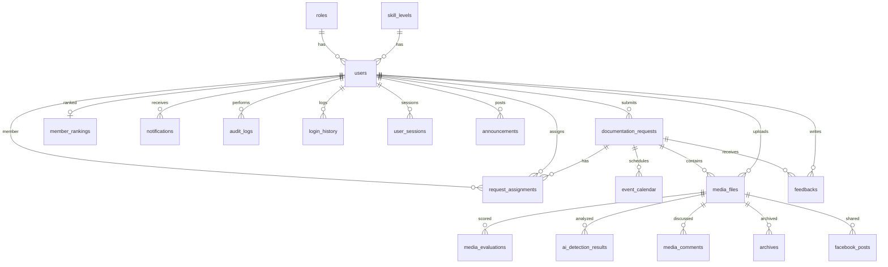

# ACCESS VisionCheck — Database Design

PostgreSQL database **`access`** with SQLAlchemy ORM models for the Admin Web App (Chrome) and Mobile User App (Android emulator), sharing one login system with role-based access.

## Connection

| Setting   | Value        |
|-----------|--------------|
| Host      | `localhost`  |
| Port      | `5432`       |
| Username  | `postgres`   |
| Database  | `access`     |

Copy `.env.example` to `.env`, set `DB_PASSWORD`, then run:

```bash
python create_tables.py
```

To reset tables during development:

```bash
set RECREATE_DB=true
python create_tables.py
```

## Recommended folder structure

```
access_backend/
├── app/
│   ├── config.py              # Settings from .env
│   ├── database.py            # Engine, SessionLocal, Base, get_db()
│   ├── models/
│   │   ├── mixins.py          # Shared timestamps
│   │   ├── role.py
│   │   ├── skill_level.py
│   │   ├── user.py
│   │   ├── documentation_request.py
│   │   ├── request_assignment.py
│   │   ├── event_calendar.py
│   │   ├── media_file.py
│   │   ├── media_evaluation.py
│   │   ├── ai_detection_result.py
│   │   ├── feedback.py
│   │   ├── member_ranking.py
│   │   ├── notification.py
│   │   ├── analytics_report.py
│   │   ├── archive.py
│   │   ├── facebook_post.py
│   │   ├── audit_log.py
│   │   ├── login_history.py
│   │   ├── user_session.py
│   │   ├── media_comment.py
│   │   ├── announcement.py
│   │   └── __init__.py        # Import all models here
│   ├── api/                   # FastAPI routes (uses models)
│   ├── crud/                  # Database operations
│   ├── schemas/               # Pydantic request/response
│   └── core/                  # Security, JWT
├── create_tables.py           # Creates tables + seeds roles/admin
├── .env.example
├── DATABASE.md                # This file
└── requirements.txt
```

## ERD — entity relationships



### Relationship summary

| Parent | Child | On delete |
|--------|-------|-----------|
| `roles` | `users.role_id` | RESTRICT |
| `skill_levels` | `users.skill_level_id` | SET NULL |
| `users` | `documentation_requests` | CASCADE |
| `documentation_requests` | `request_assignments`, `event_calendar`, `media_files`, `feedbacks` | CASCADE |
| `media_files` | evaluations, AI results, comments, archives, Facebook posts | CASCADE |
| `users` | `notifications`, `login_history`, `user_sessions`, `member_rankings` | CASCADE |

## Tables (20)

| # | Table | Purpose |
|---|--------|---------|
| 1 | `users` | Accounts (admin + mobile) |
| 2 | `roles` | Admin, Member, Organization |
| 3 | `documentation_requests` | Event coverage requests |
| 4 | `request_assignments` | Member task assignments |
| 5 | `event_calendar` | Scheduled events |
| 6 | `media_files` | Uploaded photos/videos |
| 7 | `media_evaluations` | Rubric scores |
| 8 | `ai_detection_results` | AI authenticity checks |
| 9 | `feedbacks` | Post-event ratings |
| 10 | `skill_levels` | Skill tier definitions |
| 11 | `member_rankings` | Leaderboard |
| 12 | `notifications` | In-app alerts |
| 13 | `analytics_reports` | Dashboard snapshots |
| 14 | `archives` | Archived media |
| 15 | `facebook_posts` | Facebook publish log |
| 16 | `audit_logs` | Admin audit trail |
| 17 | `login_history` | Login audit |
| 18 | `user_sessions` | Active tokens |
| 19 | `media_comments` | Media discussion |
| 20 | `announcements` | System announcements |

## Indexes

- Unique: `users.email`, `roles.role_name`, `skill_levels.level_name`, `member_rankings.user_id`
- Foreign keys are indexed for join performance
- Filter indexes: `documentation_requests.status`, `notifications.is_read`, `media_evaluations.overall_score`

## Default seed data

- **Roles:** Admin, Member, Organization  
- **Skill levels:** Novice → Master (score ranges 0.0–1.0)  
- **Admin user:** `admin@access.edu` / `admin123`

## IDs

All primary keys use **auto-incrementing integers** (`BIGINT` identity in PostgreSQL), which is simple and fast for this scale. UUIDs can be adopted later on selected tables if needed for public APIs.
