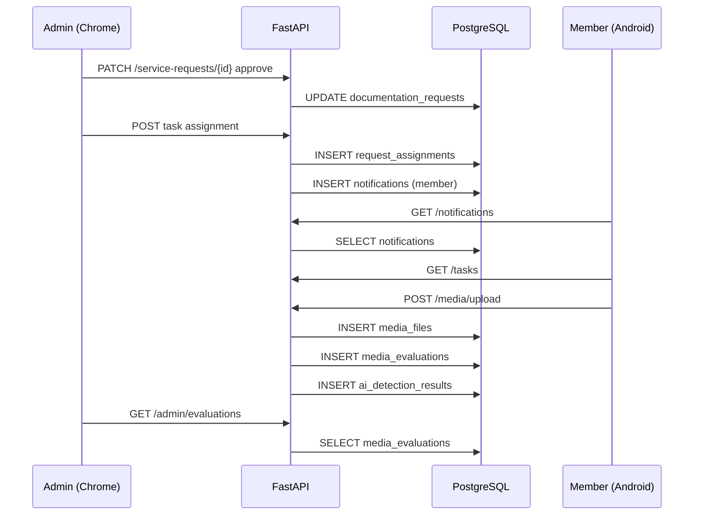
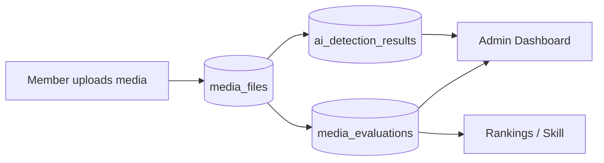
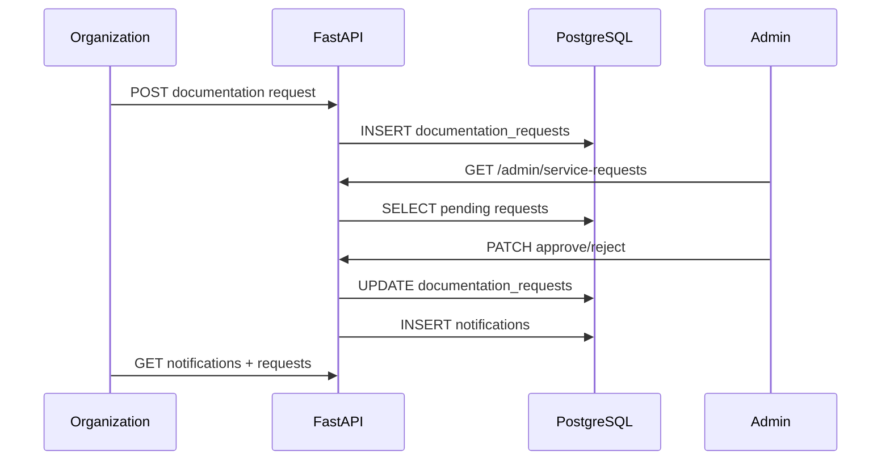
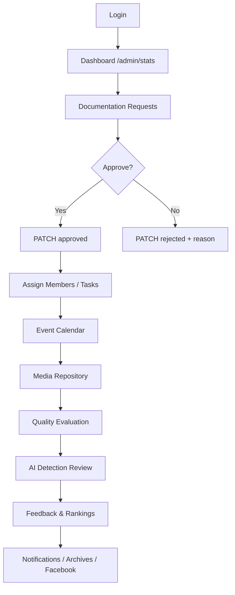
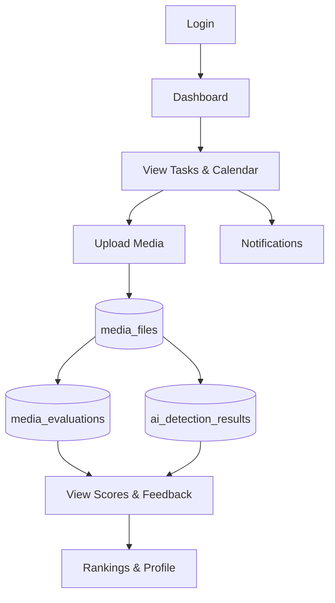
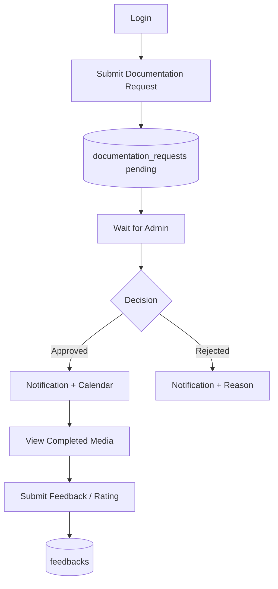
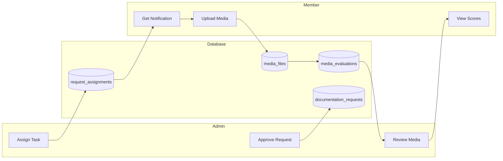
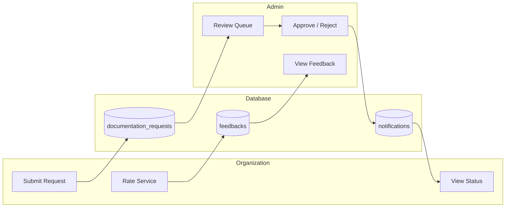
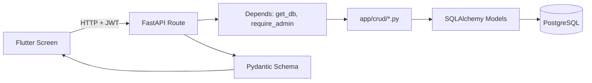

# ACCESS VisionCheck — Complete System Flow Documentation

**Version:** 1.0  
**Stack:** Flutter (Web + Mobile) → FastAPI → PostgreSQL (`access`)  
**Audience:** Developers, testers, and administrators new to the project  

---

## Table of Contents

1. [Overall System Flow](#1-overall-system-flow)
2. [Admin Flow](#2-admin-flow)
3. [Member Flow](#3-member-flow)
4. [Organization / Requestor Flow](#4-organization--requestor-flow)
5. [Admin to Member Flow](#5-admin-to-member-flow)
6. [Member to Admin Flow](#6-member-to-admin-flow)
7. [Admin to Organization Flow](#7-admin-to-organization-flow)
8. [Organization to Admin Flow](#8-organization-to-admin-flow)
9. [Database Flow](#9-database-flow)
10. [Mermaid Diagrams](#10-mermaid-diagrams)

---

## Architecture at a Glance

| Layer | Technology | Location |
|-------|------------|----------|
| **Admin UI** | Flutter Web | Chrome — `lib/web_admin/` |
| **Mobile UI** | Flutter | Android Emulator / device — `lib/mobile_app/` |
| **API** | FastAPI | `access_backend/` — port `3001` |
| **Database** | PostgreSQL 18 | Database name: `access` |

**API base URL (Flutter):** `http://10.0.22.98:3001/api` (see `lib/shared/constants/api_config.dart`)

---

## 1. Overall System Flow

### 1.1 High-level journey

Every user starts at the **same login screen** (`VisionLoginScreen`). After credentials are verified, the app reads the user’s **role** from PostgreSQL (via the API) and routes them to the correct experience.

| Step | What happens | Where |
|------|----------------|-------|
| 1 | User opens app | Chrome (web) or Android emulator |
| 2 | Login form submits email + password | `POST /api/auth/login` |
| 3 | FastAPI validates password (bcrypt) | `app/crud/user.py` → `users` table |
| 4 | JWT token returned with `userId`, `role`, `redirect_hint` | `app/core/security.py` |
| 5 | Flutter saves session + token | `AuthController` + `SharedPreferences` |
| 6 | `AuthGate` picks UI by role + platform | `lib/shared/widgets/auth_gate.dart` |

### 1.2 Role detection and redirect

| Role | Platform | Destination | `redirect_hint` |
|------|----------|-------------|-----------------|
| **Admin** | Chrome (web) | Web Admin shell (`WebAdminShell`) | `web_admin` |
| **Admin** | Mobile / wrong platform | “Use Web Admin” message | — |
| **Member** | Android emulator | Mobile `MainShell` | `mobile_app` |
| **Member** | Chrome (web) | “Use Mobile App” message | — |
| **Organization** | Android emulator | Mobile `RequesterShell` | `mobile_app` |
| **Organization** | Chrome (web) | “Use Mobile App” message | — |

**Entry point routing:**

- `lib/main.dart` → if `kIsWeb` → `web_admin/main_web.dart`, else → `mobile_app/main_mobile.dart`

### 1.3 Default test accounts

| Role | Email | Password |
|------|--------|----------|
| Admin | `admin@access.edu` | `admin123` |
| Member | `member@access.edu` | `member123` |
| Organization | `org@access.edu` | `org123` |

Create more accounts:

```bash
cd access_backend
python manage.py createuser --name "Name" --email user@access.edu --password pass --role Member --approved
```

### 1.4 Login sequence (UI → API → DB)

```
User (Flutter)          FastAPI                    PostgreSQL
     |                      |                            |
     | POST /auth/login     |                            |
     |--------------------->| SELECT users + roles       |
     |                      |--------------------------->|
     |                      |<---------------------------|
     |                      | verify bcrypt password     |
     |                      | create JWT                 |
     |<---------------------|                            |
     | store token          |                            |
     | AuthGate → role UI   |                            |
```

**Tables touched:** `users`, `roles` (read)

---

## 2. Admin Flow

**Platform:** Google Chrome — Flutter Web Admin  
**UI:** `lib/web_admin/controllers/web_admin_shell.dart` (grouped sidebar navigation)

### 2.1 Admin login

| Step | UI | API | Database |
|------|-----|-----|----------|
| 1 | `VisionLoginScreen` | — | — |
| 2 | Submit credentials | `POST /api/auth/login` | Read `users`, `roles` |
| 3 | Token stored | JWT payload: `userId`, `role: Admin` | — |
| 4 | `WebAdminShell` loads | — | — |

**Requirement:** `users.status` must be `approved`.

---

### 2.2 Dashboard analytics

| Step | UI | API | Database |
|------|-----|-----|----------|
| 1 | `AdminDashboardScreen` | `GET /api/admin/stats` | Aggregates from multiple tables |
| 2 | Stat cards displayed | Returns counts | See analytics CRUD |

**Metrics returned:**

| Card | Source tables |
|------|----------------|
| Pending requests | `documentation_requests` (status = pending) |
| Member approvals | `users` (status = pending) |
| Upcoming events | `event_calendar` |
| Evaluations | `media_evaluations` |
| AI flagged | `ai_detection_results` |
| Active members | `users` + `roles` (Member, approved) |

---

### 2.3 Documentation requests (view / approve / reject)

| Step | UI | API | Database |
|------|-----|-----|----------|
| 1 | Sidebar → Documentation → Requests | `GET /api/admin/service-requests` | Read `documentation_requests` + `users` |
| 2 | List of requests | JSON with requester name, title, venue, status | — |
| 3 | Click **Approve** | `PATCH /api/service-requests/{id}` `{ "status": "approved" }` | Update `documentation_requests.status` |
| 4 | Click **Reject** | `PATCH ...` `{ "status": "rejected" }` | Update `documentation_requests.status`, optional `rejection_reason` |

**Related sidebar items (sample UI + planned API):**

- Approve Requests — filtered view of pending items  
- Reject Requests — history of rejected items  
- Request Status — breakdown by status  

---

### 2.4 Assign members to tasks

| Step | UI | API (planned) | Database |
|------|-----|---------------|----------|
| 1 | Task Assignments screen | `POST /api/tasks` | Insert `request_assignments` |
| 2 | Pick member + request | Link `member_id`, `request_id`, `assigned_by` | — |
| 3 | Member notified | `POST /api/notifications` | Insert `notifications` |

**Table:** `request_assignments` (`member_id`, `request_id`, `assigned_by`, `task_role`, `status`)

---

### 2.5 Event calendar

| Step | UI | API (planned) | Database |
|------|-----|---------------|----------|
| 1 | Event Calendar screen | `GET /api/events` or calendar endpoint | Read `event_calendar` |
| 2 | Create / edit event | `POST` / `PATCH` | Insert/update `event_calendar` linked to `request_id` |

**Table:** `event_calendar` (`request_id`, `title`, `start_date`, `end_date`, `venue`)

---

### 2.6 Media repository

| Step | UI | API (planned) | Database |
|------|-----|---------------|----------|
| 1 | Media Repository screen | `GET /api/media` | Read `media_files` |
| 2 | Filter by event / request | Query params | Join `documentation_requests` |
| 3 | Archive action | `POST /api/archives` | Insert `archives` |

**Table:** `media_files` (`uploaded_by`, `request_id`, `file_name`, `file_type`, `file_url`)

---

### 2.7 Media quality evaluation (admin review)

| Step | UI | API (planned) | Database |
|------|-----|---------------|----------|
| 1 | Media Evaluation screen | `GET /api/admin/evaluations` | Read `media_evaluations` |
| 2 | View rubric scores | sharpness, brightness, contrast, blur, noise, overall | — |
| 3 | Approve / add feedback | `PATCH` evaluation | Update `media_evaluations.feedback` |

**Table:** `media_evaluations` (`media_id`, scores, `overall_score`, `feedback`, `evaluated_at`)

---

### 2.8 AI-generated content detection

| Step | UI | API (planned) | Database |
|------|-----|---------------|----------|
| 1 | AI Detection screen | `GET` flagged media | Read `ai_detection_results` |
| 2 | Review probability + result | `ai_probability`, `detection_result` | — |
| 3 | Mark reviewed | `PATCH` | `reviewed_by_admin = true` |

**Table:** `ai_detection_results` (`media_id`, `ai_probability`, `detection_result`, `reviewed_by_admin`)

---

### 2.9 Feedback and ratings

| Step | UI | API (planned) | Database |
|------|-----|---------------|----------|
| 1 | Feedback Reports screen | `GET /api/feedback` | Read `feedbacks` |
| 2 | View rating + comment | Per `request_id`, `user_id` | — |

**Table:** `feedbacks` (`request_id`, `user_id`, `rating`, `comment`)

---

### 2.10 Skill classification and rankings

| Step | UI | API | Database |
|------|-----|---------------|----------|
| 1 | Skill Classification screen | Read skill tiers | `skill_levels` |
| 2 | Member skill on profile | — | `users.skill_level_id` |
| 3 | Rankings screen | `GET /api/rankings` | `member_rankings` + `users` |

**Tables:** `skill_levels`, `member_rankings` (`user_id`, `total_points`, `rank_position`)

---

### 2.11 Notifications, archives, Facebook

| Feature | UI module | API (planned) | Table |
|---------|-----------|---------------|-------|
| Notifications | System → Notifications | `GET/POST /api/notifications` | `notifications` |
| Archives | Media → Archives | `GET/POST /api/archives` | `archives` |
| Facebook | System → Facebook | Facebook integration routes | `facebook_posts` |

---

### 2.12 Member management (RBAC)

| Step | UI | API | Database |
|------|-----|-----|----------|
| 1 | User Management → Members | `GET /api/users` | Read `users`, `roles` |
| 2 | Approve registration | `PATCH /api/users/{id}/status` | `users.status = approved` |
| 3 | Create user | `POST /api/users` | Insert `users` |

---

## 3. Member Flow

**Platform:** Android Emulator (Flutter Mobile)  
**UI:** `MainShell` in `lib/mobile_app/controllers/app.dart`

### 3.1 Member login

| Step | UI | API | Database |
|------|-----|-----|----------|
| 1 | `VisionLoginScreen` | `POST /api/auth/login` | Read `users`, `roles` |
| 2 | Role = Member, platform = mobile | `redirect_hint: mobile_app` | — |
| 3 | `MainShell` dashboard | — | — |

---

### 3.2 Assigned tasks and events

| Step | UI | API (planned) | Database |
|------|-----|---------------|----------|
| 1 | Dashboard / tasks view | `GET /api/tasks?assigned_to={userId}` | `request_assignments` |
| 2 | Calendar screen | `GET /api/events` | `event_calendar` |
| 3 | View assignment details | — | `request_assignments`, `documentation_requests` |

---

### 3.3 Notifications

| Step | UI | API (planned) | Database |
|------|-----|---------------|----------|
| 1 | Notification bell / sheet | `GET /api/notifications` | `notifications` WHERE `user_id` |
| 2 | Mark all read | `PATCH /api/notifications/read-all` | `is_read = true` |

---

### 3.4 Upload media

| Step | UI | API (planned) | Database |
|------|-----|---------------|----------|
| 1 | Gallery / upload screen | `POST /api/media/upload` (multipart) | Insert `media_files` |
| 2 | File stored on server | `uploads/` directory | `file_url` saved |
| 3 | Linked to request | `request_id`, `uploaded_by` | — |

**Downstream (automatic or batch):**

- Row in `media_evaluations` (quality pipeline)  
- Row in `ai_detection_results` (AI pipeline)  

---

### 3.5 View evaluation and AI results

| Step | UI | API (planned) | Database |
|------|-----|-----|----------|
| 1 | Evaluations screen | `GET /api/evaluations` | `media_evaluations` |
| 2 | View scores + feedback | — | `feedback` text |
| 3 | AI badge / detail | — | `ai_detection_results` |

---

### 3.6 Skill, ranking, profile

| Step | UI | API | Database |
|------|-----|-----|----------|
| 1 | Rankings screen | `GET /api/rankings` | `member_rankings` |
| 2 | Profile screen | User session + profile | `users`, `skill_levels` |

---

### 3.7 Comments on tasks / media

| Step | UI | API (planned) | Database |
|------|-----|---------------|----------|
| 1 | Comment on media | `POST` comment endpoint | Insert `media_comments` |
| 2 | View thread | `GET` comments | `media_comments` (`media_id`, `user_id`, `comment`) |

---

## 4. Organization / Requestor Flow

**Platform:** Android Emulator  
**UI:** `RequesterShell` → `ServiceRequestsScreen` and related screens

### 4.1 Requestor login

| Step | UI | API | Database |
|------|-----|-----|----------|
| 1 | Same login screen | `POST /api/auth/login` | `users.role_id` → Organization |
| 2 | `RequesterShell` loads | — | — |

---

### 4.2 Submit documentation request

| Step | UI | API (planned) | Database |
|------|-----|---------------|----------|
| 1 | Service request form (title, date, venue, description) | `POST /api/documentation-requests` | Insert `documentation_requests` |
| 2 | Status set to `pending` | — | `requestor_id` = current user |
| 3 | Confirmation shown | — | — |

**Table:** `documentation_requests`

---

### 4.3 View request status

| Step | UI | API (planned) | Database |
|------|-----|---------------|----------|
| 1 | My requests list | `GET` requests for `requestor_id` | Read `documentation_requests` |
| 2 | Status chip: Pending / Approved / Rejected | — | `status`, `rejection_reason` |

---

### 4.4 Notifications (approval / rejection)

| Step | UI | API (planned) | Database |
|------|-----|---------------|----------|
| 1 | Push/in-app notification | `GET /api/notifications` | `notifications` |
| 2 | Message explains outcome | — | — |

---

### 4.5 View completed output

| Step | UI | API (planned) | Database |
|------|-----|---------------|----------|
| 1 | View gallery / album for request | `GET /api/media?request_id=` | `media_files` |
| 2 | Download or browse | `file_url` | — |

---

### 4.6 Rate service and feedback

| Step | UI | API (planned) | Database |
|------|-----|---------------|----------|
| 1 | Feedback form (stars + comment) | `POST /api/feedback` | Insert `feedbacks` |
| 2 | Linked to request | `request_id`, `user_id` | — |

---

## 5. Admin to Member Flow

End-to-end: admin action → member sees work.



| # | Admin action | Member effect | Tables |
|---|--------------|---------------|--------|
| 1 | Approves documentation request | Request becomes assignable | `documentation_requests` |
| 2 | Assigns member to task | Member sees task | `request_assignments`, `notifications` |
| 3 | Adds calendar event | Member sees date/venue | `event_calendar` |
| 4 | Reviews uploaded media | Member may get feedback notification | `media_evaluations`, `notifications` |
| 5 | Updates skill / ranking | Member profile reflects performance | `skill_levels`, `member_rankings` |

---

## 6. Member to Admin Flow

End-to-end: member action → admin dashboard updates.

| # | Member action | Admin sees | Tables |
|---|---------------|------------|--------|
| 1 | Uploads photo/video | New row in media repository | `media_files` |
| 2 | System runs quality rubric | Evaluation scores | `media_evaluations` |
| 3 | AI pipeline runs | Detection result | `ai_detection_results` |
| 4 | — | Dashboard evaluation count ↑ | `analytics` aggregate |
| 5 | — | AI flagged count ↑ (if suspicious) | `ai_detection_results` |
| 6 | Good scores over time | Rankings / skill updated | `member_rankings`, `users.skill_level_id` |



---

## 7. Admin to Organization Flow

| # | Admin action | Requestor experience | Tables |
|---|--------------|----------------------|--------|
| 1 | Approves request | Notification: approved | `documentation_requests`, `notifications` |
| 2 | Creates calendar entry | Event visible in planning | `event_calendar` |
| 3 | Rejects with reason | Notification + `rejection_reason` shown | `documentation_requests` |
| 4 | Marks work complete | Requestor can view media | `documentation_requests`, `media_files` |
| 5 | — | Requestor submits rating | `feedbacks` |

---

## 8. Organization to Admin Flow

| # | Requestor action | Admin experience | Tables |
|---|------------------|------------------|--------|
| 1 | Submits documentation request | New pending item | `documentation_requests` |
| 2 | — | Dashboard pending count ↑ | analytics query |
| 3 | — | Admin opens Doc Requests list | `GET /admin/service-requests` |
| 4 | — | Approve or reject | `PATCH /service-requests/{id}` |
| 5 | Submits feedback after event | Feedback reports | `feedbacks` |



---

## 9. Database Flow

For each **major action**, the primary tables affected:

### Authentication

| Action | HTTP | Tables | Operation |
|--------|------|--------|-----------|
| Login | `POST /auth/login` | `users`, `roles` | SELECT |
| Register | `POST /auth/register` | `users`, `roles`, `skill_levels` | INSERT |
| Session (optional) | — | `user_sessions`, `login_history` | INSERT |

### Documentation lifecycle

| Action | Tables | Operation |
|--------|--------|-----------|
| Submit request | `documentation_requests` | INSERT |
| Approve / reject | `documentation_requests` | UPDATE `status`, `rejection_reason` |
| Assign member | `request_assignments` | INSERT |
| Schedule event | `event_calendar` | INSERT |

### Media lifecycle

| Action | Tables | Operation |
|--------|--------|-----------|
| Upload file | `media_files` | INSERT |
| Quality evaluation | `media_evaluations` | INSERT |
| AI detection | `ai_detection_results` | INSERT |
| Admin archive | `archives` | INSERT |
| Facebook share | `facebook_posts` | INSERT |
| Comment | `media_comments` | INSERT |

### People and performance

| Action | Tables | Operation |
|--------|--------|-----------|
| Approve member | `users` | UPDATE `status` |
| Skill update | `users`, `skill_levels` | UPDATE `skill_level_id` |
| Ranking update | `member_rankings` | UPDATE `total_points`, `rank_position` |
| View rankings | `member_rankings`, `users` | SELECT |

### Engagement

| Action | Tables | Operation |
|--------|--------|-----------|
| Send notification | `notifications` | INSERT |
| Read notification | `notifications` | UPDATE `is_read` |
| Submit feedback | `feedbacks` | INSERT |
| Post announcement | `announcements` | INSERT |

### Reporting and audit

| Action | Tables | Operation |
|--------|--------|-----------|
| Dashboard stats | multiple (aggregate) | SELECT |
| Save report snapshot | `analytics_reports` | INSERT |
| Admin action log | `audit_logs` | INSERT |

### Master reference table

| Table | Purpose | Key relationships |
|-------|---------|-------------------|
| `roles` | Admin, Member, Organization | → `users.role_id` |
| `skill_levels` | Novice → Master tiers | → `users.skill_level_id` |
| `users` | All accounts | Central identity |
| `documentation_requests` | Event coverage requests | → requestor, media, feedback |
| `request_assignments` | Who shoots which event | → user, request |
| `event_calendar` | Scheduled events | → request |
| `media_files` | Photos/videos | → request, uploader |
| `media_evaluations` | Rubric scores | → media |
| `ai_detection_results` | AI authenticity | → media |
| `feedbacks` | Ratings/comments | → request, user |
| `member_rankings` | Leaderboard | → user |
| `notifications` | Alerts | → user |
| `analytics_reports` | Dashboard snapshots | — |
| `archives` | Cold storage log | → media |
| `facebook_posts` | Social publish log | → media |
| `audit_logs` | Security audit | → user |
| `login_history` | Login audit | → user |
| `user_sessions` | Active tokens | → user |
| `media_comments` | Discussion on media | → media, user |
| `announcements` | Broadcast messages | → posted_by user |

---

## 10. Mermaid Diagrams

### 10.1 Overall system flow

```mermaid
flowchart TB
    subgraph Clients
        WEB[Admin Web - Chrome]
        MOB[Mobile App - Android]
    end

    subgraph Flutter
        LOGIN[VisionLoginScreen]
        GATE[AuthGate - role + platform]
        ADMIN[WebAdminShell]
        MEMBER[MainShell - Member]
        ORG[RequesterShell - Organization]
    end

    subgraph API["FastAPI :3001 /api"]
        AUTH[/auth/login]
        ADM[/admin/*]
        USR[/users]
    end

    subgraph DB[(PostgreSQL access)]
        USERS[(users)]
        REQ[(documentation_requests)]
        MEDIA[(media_files)]
    end

    WEB --> LOGIN
    MOB --> LOGIN
    LOGIN --> AUTH
    AUTH --> USERS
    LOGIN --> GATE
    GATE -->|Admin + Web| ADMIN
    GATE -->|Member + Mobile| MEMBER
    GATE -->|Org + Mobile| ORG
    ADMIN --> ADM
    ADMIN --> USR
    MEMBER --> API
    ORG --> API
    ADM --> DB
    API --> DB
```

### 10.2 Admin flow



### 10.3 Member flow



### 10.4 Organization / Requestor flow



### 10.5 Admin ↔ Member interaction



### 10.6 Admin ↔ Organization interaction



### 10.7 UI → API → Database (generic pattern)



**Example: Admin approves a request**

| Layer | Component |
|-------|-----------|
| UI | `AdminRequestsScreen` → Approve button |
| API | `PATCH /api/service-requests/1001` |
| Route | `documentation_requests.py` |
| CRUD | `documentation_request.update_status()` |
| Model | `DocumentationRequest` |
| Table | `documentation_requests` |

---

## Appendix A — Currently wired API routes

These routes are **registered** in `app/api/routes/__init__.py` today:

| Method | Path | Role |
|--------|------|------|
| GET | `/api/health` | Public |
| POST | `/api/auth/login` | Public |
| POST | `/api/auth/register` | Public |
| GET | `/api/admin/stats` | Admin |
| GET | `/api/admin/service-requests` | Admin |
| PATCH | `/api/service-requests/{id}` | Admin |
| GET | `/api/users` | Admin |
| POST | `/api/users` | Admin |
| PATCH | `/api/users/{id}/status` | Admin |
| GET | `/api/rankings` | Authenticated |

Additional route modules exist under `app/api/routes/` (media, tasks, events, etc.) and can be re-enabled as CRUD is migrated to the new schema. See `docs/SELF_ANNEALING.md`.

---

## Appendix B — Project paths

| Item | Path |
|------|------|
| Web Admin UI | `lib/web_admin/` |
| Mobile UI | `lib/mobile_app/` |
| Shared auth/API | `lib/shared/` |
| Backend | `access_backend/` |
| DB setup | `access_backend/create_tables.py` |
| DB docs | `access_backend/DATABASE.md` |
| This document | `docs/SYSTEM_FLOW.md` |

---

*ACCESS VisionCheck — USTP Oroquieta · Photography documentation & quality evaluation system*
